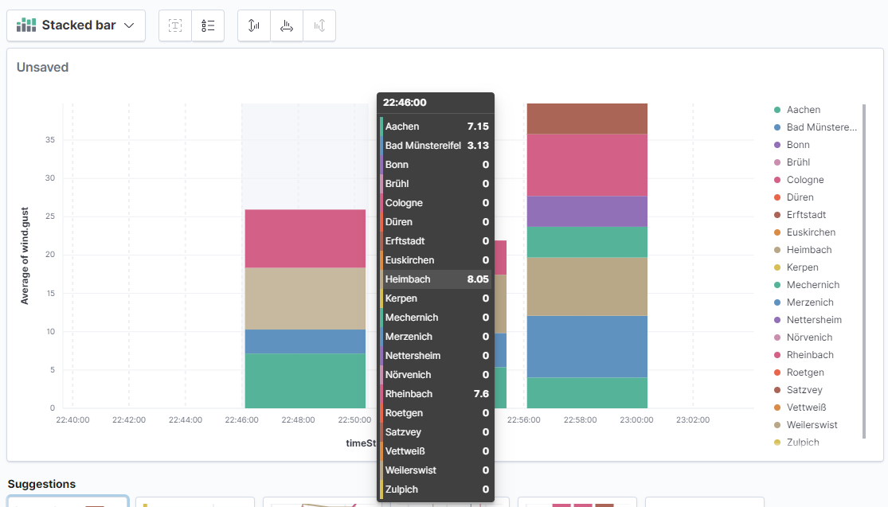
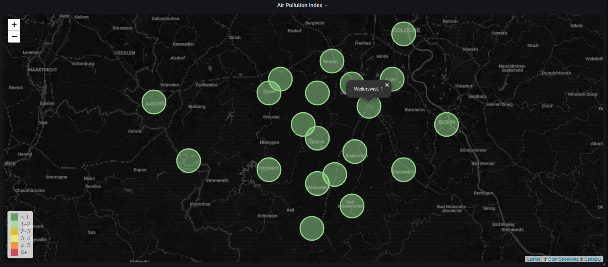
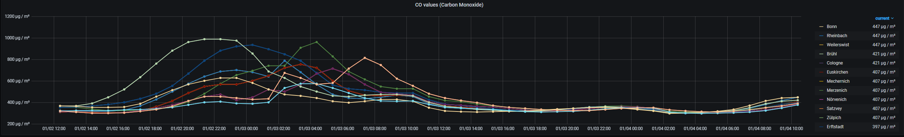
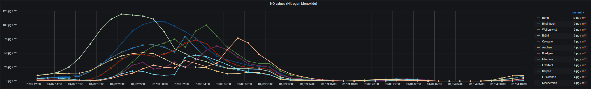
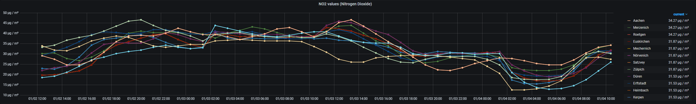
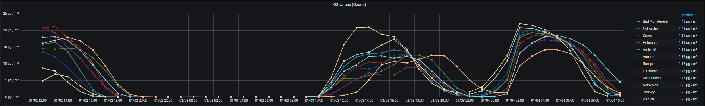
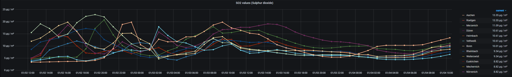
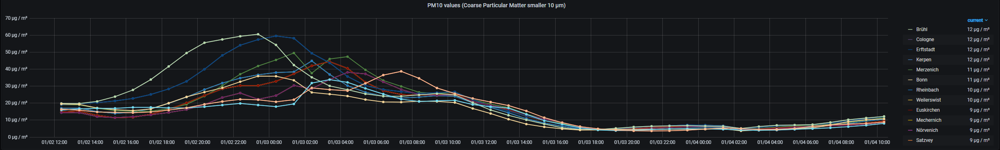
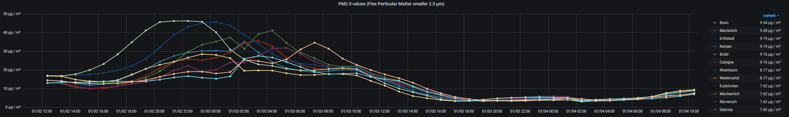
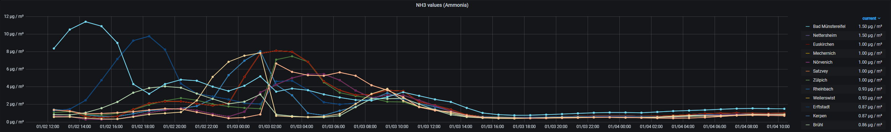

[](https://travis-ci.com/LaszloLueck/RegionalWeather) 

# RegionalWeather
## Description
See current state for a short briefing about the final solution.
- Written in C#
- Runs in a Docker-Container
- Stores data in elastic
- visualization? Don´t know, think kibana or grafana or kibana and grafana.
- in any case dotnet core 5.x / c# 9


...

## How it works
The simplest way to get this piece of code working, ist you use it as docker-container.
For the docker-container you need 2 things.
- The docker-compose.yaml, i recommend to use docker-compose for handling the parameters.
- The parameter to get and build a container from the image.

### docker-compose.yaml
First, lets have a look to the docker-compose.yaml
```yaml
version: "3.7" 

services:
  regionalweather:
    container_name: regionalweather
    image: regionalweather:latest
    networks:
      default:
        ipv4_address: 192.168.19.20
    logging:
      driver: "json-file"
      options:
        max-size: "10k"
        max-file: "20"
    environment:
      - RunsEvery=300
      - Parallelism=5
      - PathToLocationsMap=./locations/Locations.txt
      - ElasticHostsAndPorts=http://192.168.19.19:9200
      - OwmApiKey=THEKEYYOUWOULDRECEIVEIFYOUREGISTERONOWM
      - ElasticIndexName=weatherlocations[-MMyyyy]
      - FileStorageTemplate=./storage/FileStorage_[CURRENTDATE].dat
      - ReindexLookupEvery=60
      - ReindexLookupPath=./backup
      - AirPollutionRunsEvery=3600
      - AirPollutionIndexName=airpollutionindex[-MMyyyy]
      - AirPollutionLocationsFile=./locations/AirPollutionLocations.txt
      - AirPollutionFileStoragePath=./storage/AirPollution_[CURRENTDATE].dat
    volumes:
      - .regionalweather:/app/locations
      - .storage:/app/storage
      - .backup:/app/backup
    restart: always
networks:
  default:
    external:
      name: static-net
```

Explanations follows, too tired atm.

## Changes
### 2021-03-26
Next update is here. This update contains a change in logging concept.
So far, logging has only been done via the console with standard .NET board resources. The Docker container is started in such a way that after a log size of 200 KB the oldest entries are lost (log rotation). However, if errors occurred, this means that you have no way of tracking them if the log limit is exceeded. Now you could also write the logs to files, which makes the search for certain entries complicated. That's why I rewritten the application so that log entries are also written to Elasticsearch. 

Why? 

Elasticsearch is already in use for storing weather data and it is a powerful search index for searching over large amounts of data. 


### 2021-03-08
Today comes a big update.
- A bunch of dependency bumps to current versions
- Rework / Refactoring of how to the storage in elastic works. Currently all the data would be stored in a single index. For less amount of data, this solution works fine. After 3 months, in my single index are approx. 500.000 documents stored. The more data there is in a single index, the slower the index works for complex queries over longer periods of time. For this I have rewritten the program in such a way that the data is written in different indexes based on time. This is called time-based sharding. This works for new data as well as for data that is added to the index from a backup (reindexing). 

### 2021-01-01 Happy new year!
The new year starts with a big refactoring and the implementation of the whole airpollution-thing. More information tomorrow, too late for today.

Cheers!

### 2020-12-27 Prerequisits done
A medium refactoring is done. Now it is relativly easy possible, to implement other data imports to elastic (and store to filesystem).
Next step is, to import the air polution data within another scheduler (every 1h).
After that, i promise by my left and right hand, tests and documentation will follow.
And more dashboards....

Cheers!

### 2020-12-22 Next things to do
- Since a few weeks, owm published a new api that presents data about air pollution for a specific place. That looks very nice to archive.
- I have many space on my server @home. Time to build a dockerized version of wordpress to open up a presentational site for this project. That would be also a place to describe, why i wrote the code as i did it in this project, with some hints and do´s and dont´s.

Be patient!

### 2020-12-21 Parallelism works
With the configuration setting parallelism, you can set how many parallel tasks process the etl (e.g. read for location, process the data, write to elastic). Currently i set this to 5 on my machine (24 Core / 128 GB RAM HP ML 350 server) and it works like a charm (even with more parallelism), but why, for such a small, short running, process.


### 2020-12-19 Stick this all together
Now, all the stuff in SchedulerJob works complete async / awaitable.
```c#
                var locationList =
                    (await new LocationFileReader().Build(configuration).ReadConfigurationAsync()).ValueOr(
                        new List<string>());

                var rootTasksOption = locationList.Select(async location =>
                    await OwmApiReader.ReadDataFromLocationAsync(location, configuration.OwmApiKey));

                var rootStrings = (await Task.WhenAll(rootTasksOption)).Values();
                var toElastic = (await Task.WhenAll(rootStrings.Select(async str => await DeserializeObjectAsync(str))))
                    .Where(item => item != null)
                    .Select(itemNullable =>
                    {
                        var item = itemNullable!;
                        item.ReadTime = DateTime.Now;
                        return item!;
                    });
                var concurrentBag = new ConcurrentBag<Root>(toElastic);
                await storageImpl.WriteAllDataAsync(concurrentBag);
                var elasticDocs =
                    await Task.WhenAll(concurrentBag.Select(async root =>
                        await OwmToElasticDocumentConverter.ConvertAsync(root)));
                await elasticConnection.BulkWriteDocumentsAsync(elasticDocs, configuration.ElasticIndexName);
```

It looks not as beautyful as the sync version but, anyway...

...now it´s modern not aesthetic.

Cheers!
Aaaah, and here is the one that convert async / await a string to an object (JsonDeserialize).
```c#
        private static async ValueTask<Root?> DeserializeObjectAsync(string data)
        {
            await using MemoryStream stream = new();
            var bt = Encoding.UTF8.GetBytes(data);
            await stream.WriteAsync(bt.AsMemory(0, bt.Length));
            stream.Position = 0;
            return await JsonSerializer.DeserializeAsync<Root>(stream);
        }
```


### 2020-12-14 Next step of async / await - Part 2
For now i am 2 steps away from complete refactoring. First is the call, who get the current weatherinformations of a location
- OwmApiReader.ReadDataFromLocation

and the second part is the transform of the json to an appropriate object
- JsonSerializer.Deserialize

Let´s do this!

### 2020-12-14 finished refactoring async / await - Part 1
Last night i had the idea, how to solve the challenge with async / await and linq.
I redesigned or reorder the etl-process. The described method for that looks now:

```c#
locationsOpt.MatchSome(async locations =>
                {
                    var results = locations.Select(location =>
                    {
                        return OwmApiReader.ReadDataFromLocation(location, configuration.OwmApiKey)
                            .Select(data => JsonSerializer.Deserialize<Root>(data))
                            .Where(element => element != null)
                            .Select(element => element!)
                            .ValueOrFailure();
                    });


                    var resultTasks = results.Select(async root =>
                    {
                        await storageImpl.WriteDataAsync(root);
                        return await OwmToElasticDocumentConverter.ConvertAsync(root);
                    });
                    var ts = await Task.WhenAll(resultTasks);
                    await elasticConnection.BulkWriteDocumentsAsync(ts, configuration.ElasticIndexName);
                });

```

First i read that and convert it to the to. Then i write the doc to file, convert it as elastic doc and write the ienumerable<ElasticDoc> to elastic.
  

### 2020-12-13 adding rain and gust
From the owm api documentation i did'nt see that there are parameters for wind.gust and rain (1h / 3h).
I've added the parameter to the elastic document and put it to the etl process.
After a remove index / import all the backup files / refresh index pattern we could see some values (see screenshot).
Damn, no rain for 2 days, rain.1h and rain.3h is always 0. ;)

</img>

Also i implement some more things async / awaitable.

The etl-process is currently mostly synchron / blocking. The reason is, that LINQ is not as much async await compatible as i hoped.

In scala, you can process things with map / flatmap keywords. The handling in c# isn't here so optimal.
Currently in C# the code for reading / processing / writing / indexing looks like (from SchedulerJob.cs):

```c#
locationsOpt.MatchSome(async locations =>
                {
                    var results = locations.Select(location =>
                    {
                        return OwmApiReader.ReadDataFromLocation(location, configuration.OwmApiKey)
                            .Select(data => JsonSerializer.Deserialize<Root>(data))
                            .Where(element => element != null)
                            .Select(element => element!)
                            .Select(element => storageImpl.WriteData(element))
                            .Flatten()
                            .Select(OwmToElasticDocumentConverter.Convert)
                            .ValueOrFailure();
                    });

                    await elasticConnection.BulkWriteDocumentsAsync(results, configuration.ElasticIndexName);
                });
```
It´s not so easy to rebuild that async / awaitable. If you see the `JsonSerializer.Deserialize` line. If i rewrite this async, the result is a Task<>. The next line must be a Task-Handler and so on. In Scala the code looks like the above (other syntax ok) and is easy readable.

On the other side, i reimport and reindex approx. 7.000 documents in 2 seconds (read from file, process, write to es).

There are other things more important.

Cheers!


### 2020-12-12 update data handling
Until now, the data-property for the timeseries index like prometheus or elasticsearch was the field owm.dateTime. But this field represents the timestamp of the last measurement of the location. I decided to reimplement some things, but this makes the, until now, collected data unusuable.
When i read a dataset for a location i inject and store the current timestamp to the json. This json would be stored in the storage files and would be stored in elastic.

If you need, to reindex the whole data, the timestamp is reindexed also. If you plan to use a timeseries database like prometheus or influx or whatever, don't forget to select the field "timeStamp" as the datafield for the timeseries.

Cheers!

### 2020-12-12 early in the morning
- I´ve finished the reindexer. This piece of code looks continously in a specified folder for files, take the data and reindex the data to elasticsearch. If the data is reindexed, the file will be deleted. For that todo, i have created another scheduler.
- Another thing i have implemented ist the bulk indexing functionality. Before, every document would be inserted in elastic in a single step. From now on, all the defult work (takes the current weather data) would be written to elastic in one bulk step. If you reindex a document of a day (for my setting => Every 12 measurements per hour * 24 * 20 locations) with 5760 elements, it is not such a good idea to reindex line by line. With the bulk operation, i reindex now 100 documents in one piece. With that bulk thing 5760 documents would be reindexed in 2 seconds. Not so bad for a single es instance.
- For the bulk thing and because i found the code nice i refactor it a little and use a lot of more linq / lambda shit.

## How it looks like (very prototypish)
### 2021-01-03
The following images shows samples about airpollution values for various places over time (last 48h in this case).

### Air Pollution Index (Current value 1 (best) to 5 (worst))
</img>

#### Carbon Monoxide (CO)
</img>

#### Nitrogen Monoxide (NO)
</img>

#### Nitrogen Dioxide (NO<sub>2</sub>)
</img>

#### Ozone (O<sub>3</sub>)
</img>

#### Sulphur Dioxide (SO<sub>2</sub>)
</img>

#### Coarse Particular Matter (PM10, values smaller 10µm)
</img>

#### Fine Particular Matter (PM25, values smaller 2.5µm)
</img>

#### Ammonia (NH<sub>3</sub>)
</img>

### 2020-12-02
Here you have a look a the grafana dashboard looks like. Above the temperature of 20 selected locations around me plotted as a time series. The second Panel is a Worldmap item that shows the current temperatures in the map.
Not bad for first prototype, but a lot of work to do...

The screenshot shows an example of a grafana dashboard with realtime data


This screenshot shows, how its look like with Kibana. Left, the geo-map with current temperatures, right the temperature timeline splitted by location.
</img>

I don´t know, what graph-visualization tool win at the end, maybe there could be 2 tools for same things.

## Current State
Currently this project is a lot more as an collection of ideas and a bunch of code.
I imagine the following:
- Reading of current weather information via OpenWeatherMap (https://openweathermap.org/) via its API --> check
- Full amount of locations can be configured. --> check, realized per file
- In order of your selected OWM-plan, please be aware of the amount of API-calls (e.g. free plan  = max. 1.000.000 calls per month / max. 60 calls per min.).
- The current weather information is called up every minute (configurable) --> check, currently it runs every 5 min.
- And stored with the corresponding geographic information in an ES instance. --> check, it works, really!
- With Grafana or another tool, the weather information is made visible on a website (e.g. heat maps, graphs or similar). --> check, looks not bad.
- The storage takes place continuously, which means that historical views are also possible. --> check, it works by default with elastic.

## What currently work (in some parts, not as a complete project)
- I must delete the index and all the data are gone! Bad thing! But i would create a solution. I code a custom reindexer, that runs scheduled an look into a configurable directory. If there is any of the backup files, the data of that file would be reindexed.
- Store the plain results of owm as file. Reason: For later possibility of complete reload historic data in a (possible new) elastic index. Also if i made changes in index- or data-settings we could use this, because currently i store not all data from owm to es.
- Read out the weather informations for configurable places
- convert the json to appropriate objects in c#
- establish a connection to one or more elasticsearch instances
- create an index
- create a mapping
- check if the index exists
- delete the index
- mount the locations file outside of the container so it is fully configurable from the host.
- store the weather information to elastic
- dashboard (very prototypish)
- containerization (runs as docker container on my server)
- transform the original weather-to to an appropriated elastic to (only fields that i need)

## Whats next?
- currently the core thing of the app works blocking and not async / awaitable. That would be refactored shortely!
- put a lot more visualisations to the dashboards. Currently it is only testwise.
- travis functions
- sonar functions
- testcoverage

