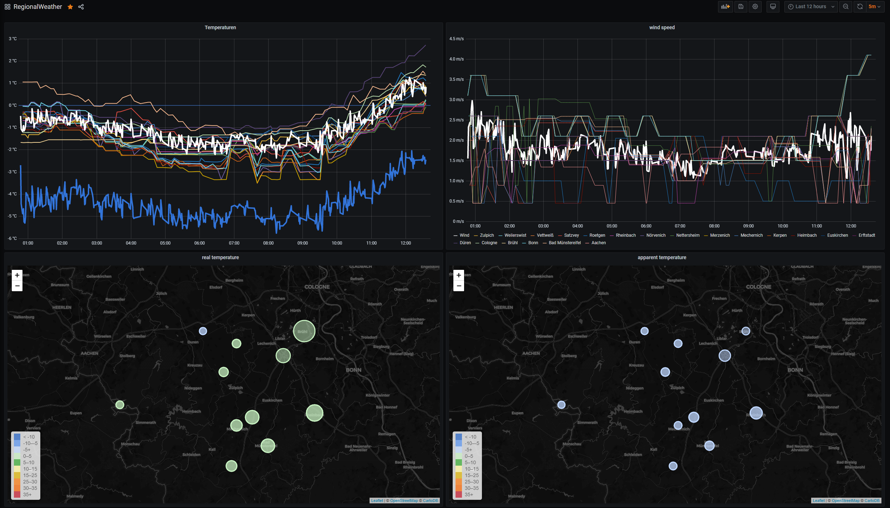

# RegionalWeather
## Description
See current state for a short briefing about the final solution.
- Written in C#
- Runs in a Docker-Container
- Stores data in elastic
- visualization? Don´t know, think kibana or grafana.
- in any case dotnet core 5.x / c# 9

...

## Changes
### 2020-12-12 early in the morning
- I´ve finished the reindexer. This peace of code looks continously in a specified folder for files, take the data and reindex the data to elasticsearch. If the data is reindexed, the file will be deleted. For that todo, i have created another scheduler.
- Another thing i have implemented ist the bulk indexing functionality. Before, every document would be inserted in elastic in a single step. From now on, all the defult work (takes the current weather data) would be written to elastic in one bulk step. If you reindex a document of a day (for my setting => Every 12 measurements per hour * 24 * 20 locations) with 5760 elements, it is not such a good idea to reindex line by line. With the bulk operation, i reindex now 100 documents in one piece. With that bulk thing 5760 documents would be reindexed in 2 seconds. Not so bad for a single es instance.
- For the bulk thing and because i found the code nice i refactor it a little and use a lot of more linq / lambda shit.

## How it looks like (very prototypish)
Here you have a look a the grafana dashboard looks like. Above the temperature of 20 selected locations around me plotted as a time series. The second Panel is a Worldmap item that shows the current temperatures in the map.
Not bad for first prototype, but a lot of work to do...

The screenshot shows an example of a grafana dashboard with realtime data

This screenshot shows, how its look like with Kibana. Left, the geo-map with current temperatures, right the temperature timeline splitted by location.
</img>

I don´t know, what graph-visualization tool win at the end, maybe there could be 2 tools for same things.

## Current State
Currently this project is a lot more as an collection of ideas and a bunch of code.
I imagine the following:
- Reading of current weather information via OpenWeatherMap (https://openweathermap.org/) via its API --> check
- Full amount of locations can be configured. --> check, realized per file
- In order of your selected OWM-plan, please be aware of the amount of API-calls (e.g. free plan  = max. 1.000.000 calls per month / max. 60 calls per min.).
- The current weather information is called up every minute (configurable) --> check, currently it runs every 5 min.
- And stored with the corresponding geographic information in an ES instance. --> check, it works, really!
- With Grafana or another tool, the weather information is made visible on a website (e.g. heat maps, graphs or similar). --> check, looks not bad.
- The storage takes place continuously, which means that historical views are also possible. --> check, it works by default with elastic.

## What currently work (in some parts, not as a complete project)
- I must delete the index and all the data are gone! Bad thing! But i would create a solution. I code a custom reindexer, that runs scheduled an look into a configurable directory. If there is any of the backup files, the data of that file would be reindexed.
- Store the plain results of owm as file. Reason: For later possibility of complete reload historic data in a (possible new) elastic index. Also if i made changes in index- or data-settings we could use this, because currently i store not all data from owm to es.
- Read out the weather informations for configurable places
- convert the json to appropriate objects in c#
- establish a connection to one or more elasticsearch instances
- create an index
- create a mapping
- check if the index exists
- delete the index
- mount the locations file outside of the container so it is fully configurable from the host.
- store the weather information to elastic
- dashboard (very prototypish)
- containerization (runs as docker container on my server)
- transform the original weather-to to an appropriated elastic to (only fields that i need)

## Whats next?
- currently the core thing of the app works blocking and not async / awaitable. That would be refactored!
- travis functions
- sonar functions
- testcoverage

